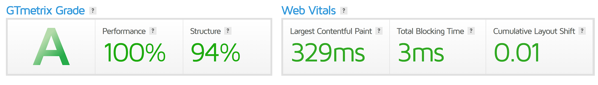

# 50 Days 50 Project

###### Only HTML CSS & JavaScript

## Live Preview

[Netlify Live Server](https://akash07105.netlify.app)

### List of Projects --

- Project 1 - Expanding Cards
- Project 2 - Progress Steps
- Project 3 - Rotating Navbar
- Project 4 - Hidden Search Widget
- Project 5 - Blurry Loading
- Project 6 - Scroll Animation
- Project 7 - Split Landing Page
- Project 8 - Math is Fun
- Project 9 - Battery Animation
- Project 10 - Form Wave Animation
- Project 11 - Sound Board
- Project 12 - Dad Joke - Fetch From API
- Project 13 - Event Key Code
- Project 14 - FAQ Box
- Project 15 - Random Choice Picker
- Project 16 - Nav Animation
- Project 17 - Quote Generator
- Project 18 - Apple eCommerce
- Project 19 - Card UI Hover Effect
- Project 20 - Infinite Scroll
- Project 21 - Analog Digital Clock
- Project 22 - Claymorphism List
- Project 23 - Icon DropShadow
- Project 24 - Glass Morphism Landing Page
- Project 25 - Movies Review
- Project 26 - Social Media Hover Icon
- Project 27 - Product Design
- Project 28 - Our Team
- Project 29 - Z - Index Hover Effect
- Project 30 - CSS 9-Dots Menu
- Project 31 - Navigation Menu - Curved
- Project 32 - Picture in Picture
- Project 33 - Social Counter
- Project 34 - Natours

## [GTMetrix Report](https://gtmetrix.com/)

- GTMetrix Website Score 👉👇
  - 

## Important for Pull and Push

- Fetching changes from github: `git fetch`
- Merging changes from github: `git merge`
